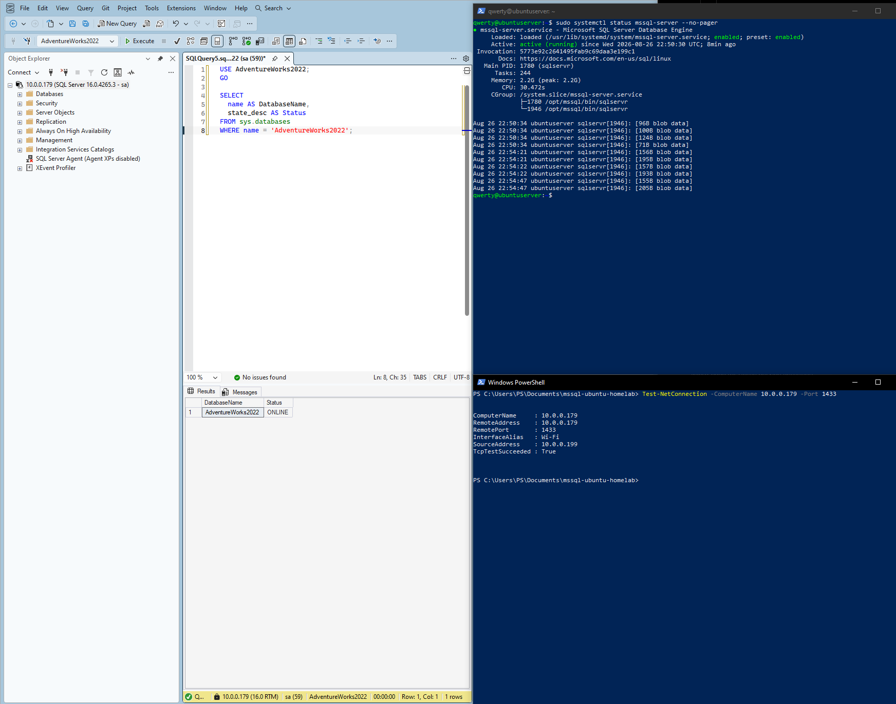
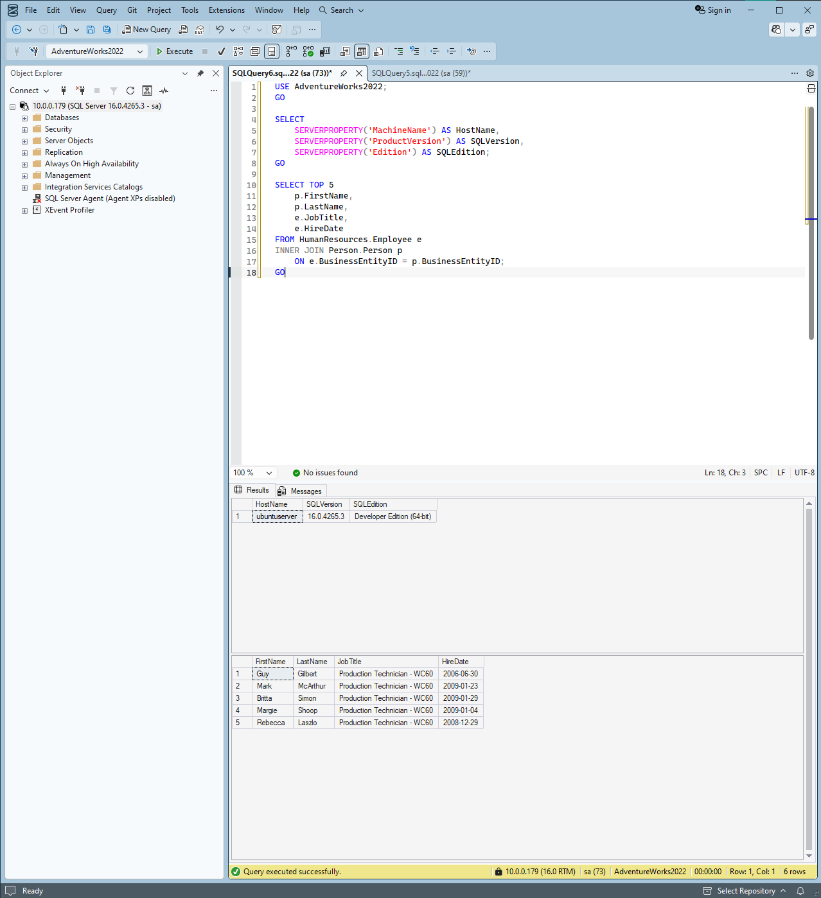

# Microsoft SQL Server 2022 on Ubuntu 22.04 LTS — Lab Log & Runbook

## Project Overview
Deployment, network configuration, dependency resolution, and database restoration for MS SQL Server 2022 running on an Ubuntu Server host (`10.0.0.179`), managed remotely via SQL Server Management Studio (SSMS 20).

## Infrastructure Details
* **Host Operating System:** Ubuntu Server 22.04 LTS (`10.0.0.179`)
* **Database Engine:** Microsoft SQL Server 2022
* **Management Client:** SQL Server Management Studio (SSMS 20) on Windows
* **Sample Dataset:** `AdventureWorks2022`

---

## Deployment & Troubleshooting History

### 1. Host Name & Package Resolution Failure (DNS / Netplan)
* **Problem:** `wget` and `apt` operations failed with `unable to resolve host address`.
* **Root Cause:** Active Netplan configuration lacked external public DNS forwarders.
* **Resolution:** Injected Google Public DNS (`8.8.8.8`) into `/etc/resolv.conf` and updated Netplan configuration.

### 2. Missing Engine Dependency (`libldap-2.5-0`)
* **Problem:** SQL Server installation failed due to a missing shared library (`libldap-2.5.so.0`), which is deprecated/removed in Ubuntu 22.04 default repos.
* **Resolution:** Manually pulled the official `libldap-2.5-0_2.5.16` `.deb` package from Ubuntu security mirrors using `wget` and installed it via `dpkg -i`.

### 3. Service Constraint on `sa` Credential Reset
* **Problem:** Attempting to run `sudo /opt/mssql/bin/mssql-conf set-sa-password` threw an error stating an instance of SQL Server was actively running.
* **Resolution:** Stopped the database service using `systemctl`, executed the reset configuration utility, and restarted the engine:
  ```bash
  sudo systemctl stop mssql-server
  sudo /opt/mssql/bin/mssql-conf set-sa-password
  sudo systemctl start mssql-server

### 4. Database Restore Path & File Ownership Fixes
* **Problem:** Restoring `AdventureWorks2022` from SSMS failed with **Operating System Error 2 (The system cannot find the file specified)**.
* **Root Cause:** Target backup filename contained a typo (`AdeventureWorks2022.bak`), and the `mssql` service account lacked file ownership.
* **Resolution:** Corrected filename syntax via `mv`, assigned service ownership, and executed T-SQL with `WITH MOVE`:
  ```bash
  # Correct filename typo
  sudo mv /var/opt/mssql/data/AdeventureWorks2022.bak /var/opt/mssql/data/AdventureWorks2022.bak

  # Set mssql service account ownership
  sudo chown mssql:mssql /var/opt/mssql/data/AdventureWorks2022.bak

---

## System Verification & Proof of Work

### 1. Service Availability & Network Connectivity
Verified that `mssql-server.service` is active on Ubuntu (`10.0.0.179`) and responding on TCP port `1433`:

```powershell
Test-NetConnection -ComputerName 10.0.0.179 -Port 1433
```



---

### 2. Database Functionality & Query Execution
Executed verification queries in SSMS 20 against `AdventureWorks2022` to validate engine metadata and relational table joins:

```sql
USE AdventureWorks2022;
GO

-- 1. Validate SQL Server host details and version
SELECT 
    SERVERPROPERTY('MachineName') AS HostName,
    SERVERPROPERTY('ProductVersion') AS SQLVersion,
    SERVERPROPERTY('Edition') AS SQLEdition;
GO

-- 2. Validate database data retrieval and table joins
SELECT TOP 10 
    p.FirstName, 
    p.LastName, 
    e.JobTitle, 
    e.HireDate
FROM HumanResources.Employee e
INNER JOIN Person.Person p 
    ON e.BusinessEntityID = p.BusinessEntityID;
GO
```

